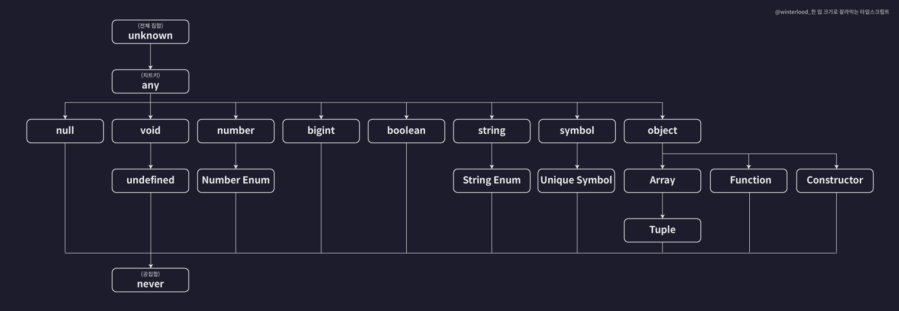

# I. [특이 타입](../section3/src/chapter2_primary_casting.ts)

## A. unknown
- 최상위 타입(like java Object class): 집합에서 U
- 다운 캐스팅만 가능
- 업케스팅은 불가
## B. never
- 최하위 타입
- 공집합 역할
- 업케스팅만 가능
## C. void 
- default 타입
- return이 지정되면 변경됨
## D. any
- 최상위 unknown 바로 아래
- `var` 처럼 제한되지 않는 타입은 위험한 타입
- never 타입을 제외한 모든 타입과 캐스팅 가능

# II. [객체 호환성](../section3/src/chapter3_literal_casting.ts)
## A. 기본 타입 호환성
- 기본 타입과 리터럴 타입간 호환성
  - 업캐스팅만 가능
  - 더 구체적인(더 제한이 큰) 타입으로의 이동의 어려움
```typescript
let num1: number = 10;// number type
let num2: 10 = 10;// number literal
//super에 child가 둘어감: upper casting
num1=num2;
// num2 = num1; down casting x
```
## B. 객체 타입 호환성
- 타입이 요구하는 속성(properties)을 근거로 타입 호환이 체크됨
- Animal 타입에 Dog 타입을 넣을때 초과 프로퍼티는 무시됨
```typescript
type Animal = {
    name: string;
    color: string;
};
type Dog = {
    name: string;
    color: string;
    bread: string;
};
let animal:Animal = {
    name:"기린",
    color:"yellow"
}
let dog:Dog={
    name: "명명",
    color: "brown",
    bread: "진도"
}
animal = dog;//복사할때 필수 값을 만족하면 캐스팅 가능
```
- 직접 객체 생성시에는 타입스크립트의 초과 프로퍼티 체크에 걸림
```typescript
let dog:animal = {
  name: "명명",
  color: "brown",
  // bread: "진도" 초과 프로퍼티 체크(in typescript)
}
```
- 함수의 인자(arguments)로 받는 경우
```typescript
function func(book:Book){}
```
- 마찬가지로 객체 직접 생성과 객체형 변수 사용시 초과 프로퍼티 체크 
```typescript
func({
    title: "react 공부",
    author: "홍길동",
    price: 34_000,
    // skill: "react.js" //초과 프로퍼티 검사(typescript)
});

func(react);
```
# III. [대수타입](../section3/src/chapter4_algebraicDataType.ts)
- 대수타입: 여러개의 타입을 합성하여 새롭게 만들어낸 타입
  - 합집합 타입(union): or 기호인  | 사용
  ```typescript
    let a: string | number;
    a = 1;
    a = "string";
    // a = true;
  ```
    - 배열에서 사용하기 
    ```typescript
      let arr: (number|string|boolean)[] = [1,"hello",true];
    ```
    - 객체에서 사용하기
    ```typescript
      type Cat = {
        name: string;
        color: string;
      }
      type Person = {
        name: string;
        language: string;
      }
      
      type Union1 = Cat | Person;
     //각각
      let union1:Union1 = {
        name:"",
        color:""
      }
      let union2:Union1 = {
        name:"",
        language:"",
      }
     //모든 속성
      let union3:Union1 = {
        name:"",
        color:"",
        language:""
      }
    ```
  - 공통된 프로퍼티(name)만 갖는 경우는 불가
    - 속성이 기준이 아닌 만들어진 객체가 후보타입(Cat, Person)에 속하는지가 중요 
    ```typescript
    // let union4:Union1 = {
    //     name:"",
    // }
    ```
  - 교집합 타입(): and 기호인 & 사용
    - 서로간의 공통점이 없는 경우 never 타입(공집합, 있을 수 없음)
    - `b is declared but its value is never read.`
    ```typescript
      let b: number&string;
      // b=1;
      // b="str";
      // b="1";
    ```
    - 교집합: 두 집합의 모든 속성을 지녀야함
      - 하나라도 빠지면 모두의 공통이 아니므로 에러
    ```typescript
    let intersection1:Intersection = {
        name:"",
        color:"",
        language:"",
    }
    ```
# IV. 타입 관련(추론, 단언, 좁히기)
## A. [타입 추론](../section3/src/chapter5_typeCheck.ts)
### 1. 변수 선언시
- 변수의 초기값을 기준으로 추론
```typescript
let a = 10;
let b = true;
let c = "";
let d = {
    name:"",
    age:1,
    pass: false
}
```
- 구조분해할당에서도 추론 진행
```typescript
let {age, name, profile} = d;
let [one, two, three] = [1,"hello",true];
```
- 함수 선언시에도 마찬가지
```typescript
function fnc(){
    return "string ";
}
```
- 선언시 추론된 상태면 그이후 제한도 진행
  - 다만 값 변경시에는 바로 변경됨
  - 암묵적 any 타입의 진화
    - 선언시 any 타입이 구체화됨 
```typescript
let num;//any
num = 10;//any -> number
num.toFixed();
// num.toUpperCase();//제한됨

num = "string";//num -> any -> string
// num.toFixed();
num.toUpperCase();//제한됨
```
- 단, 상수로 선언되는 경우 추론 후 고정
```typescript
const num2 = 10;
const str = "string";
```
- 범용적으로 사용하는 경우
  - 타입안정성을 보장하기위해 어느정도 사용. 
  - 단, 상수가 필요할때는 리터럴 사용
## B. [타입 단언](../section3/src/chapter6_typeAssertion.ts)
- 타입 단언이란 선언시 데이터 구성을 동적으로 처리하고 싶을때 사용
```typescript
let object = {} as Object;// 타입 단언
if(check()){
  object.property1 = "a";// 속성 동적 처리
  object.property2 = 2;
}
```
- 초과 프로퍼티 체크 피해가기
```typescript
// let citizen:Person={
//     name:"",
//     age: 30,
//     check:true,
//     city: "",
// }

let citizen={
  name:"",
  age: 30,
  check:true,
  city: "",
} as Person;
```
- 타입 단언의 규칙
  - `값 as 단언`
    - 값이 단언의 슈퍼타입이거나 서브타입이어야함(유사한 속성이 있어야함)
    - 다중단언을 거치면 서로 소관계인 타입간에도 사용은 가능
      - 사실상 타입스크립트를 사용할 이유가 없음
```typescript
let num1 = 10 as never;//모든 타입의 자식타입
let num2 = 10 as unknown; // 모든 타입의 부모타입
// let num3 = 10 as string;// number 타입과 string 타입은 교집합이 없으므로 공통이 아님
let num4 = 10 as unknown as string;//as unknown을 거치면 가능(다중 단언)
```
- 불변 변수로 처리하기
```typescript
let const1 = 10 as const;//리터럴로 추론
```
- 객체에서 전체 속성(property)을 불변으로 변경. 개별은 readonly로 각각 선언해야하나 `as const`로 사용 가능
- 타입 선언시
  ```typescript
  type Config = {
      readonly name: string;
      readonly age: number;
      readonly color: string;
  }
  ```
- 모든 속성을 readonly로 처리
  ```typescript
  let constObj = {
      name:"고양이",
      age: 3,
      color: "yellow",
  } as const;
  ```
- null 처리
  - !.은 값이 반드시 넘어온다는 not null 단언
  - `const len:number = post1?.author!.length;`
```typescript
//null 처리
type Post = {
    title: string;
    author?: string;//?: null을 입력받을 수 있음
}
const len:number = post1?.author.length;
//len은 author가 null인경우 undefined처리됨 
```
- 단언은 값 변환이 아닌 그럴것이라는 확신을 컴파일러에 전달해 예외를 넘김
  - 불안정하게 만들 수 있으므로 주의
## C. [타입 좁히기](../section3/src/chapter7_typeGuard.ts)
- 조건문 등을 이용해 타입의 범위를 좁히는 것
  - 특정 조건문 내에서 더 좁은 타입으로 보장됨 -> 타입 좁히기
  - 사용자 입장에서는 당연한 것이지만 컴파일러가 그렇게 조절되도록 처리
  - 여기서의 조건문처럼 타입의 제한을 만드는 구문을 타입 가드라부름
```typescript
function func(value: number | string):void{
   // number와 string의 유니온 타입
    if(typeof value === 'number'){
      //이 조건문 내부에서 무조건 number
      console.log(value.toFixed());
    }
    else if(typeof value === 'string'){
      //이 조건문 내부에서 무조건 string
      console.log(value.toLowerCase());
    }
}
```
- javascript의 객체인 Date와 null 타입도 모두 object로 체크됨 
```typescript
function func(value: number|string|Date|null){
    if(typeof value === "object"){
        //여기는 Date|null인 유니온 타입으로 사용이 제한됨
        console.log(value.getTime());//error!@!
    }
}
```
- javascript 내장 클래스는 `instanceof 객체`를 사용해 검증
```typescript
function func(value: number|string|Date|null) {
    if (value instanceof Date) {
        console.log(value.getTime());
    }
}
```
- 직접 만든 객체 타입은 해당 객체의 property의 속성명을 체크
```typescript
type Person = {
    name: string;
    age: number;
}
function func(value: number|Person) {
    if (value && 'name' in value) {
        // value가 있을때 value의 properties 중 name이라는 property가 있는지 확인
        console.log(`${value.name} - ${value.age} 세`);
    }
}1
```
# V. [서로소 유니온](../section3/src/chapter8_disjointSet.ts)
- 두 타입의 교집합이 공집합인(공통이 없는 == 서로소) 두 집합의 합집합
  - ex) string | number

## A. 회원관리 예시
- 태그를 안쓰는 경우 선택적 프로퍼티(?:)는 단락평가(?.)를 사용해 검증
```typescript
function login(user:User):string{
    const userKeys = {
        adminKey    : "kickCount",
        memberKey   :  "point",
        guestKey    : "visitCount",
    } as const;
    if(userKeys.adminKey in user){
        return `${user.name}님. 현재까지 ${user.kickCount}명 강퇴했습니다.`;
    }
    else if(userKeys.memberKey in user){
        return `${user.name}님. 현재까지 ${user.point} 모았습니다.`;
    }
    else if(userKeys.guestKey in user){
        return `${user.name}님. 현재까지 ${user.visitCount}번 방문하셨습니다.`;
    }
    else{
        return "등록되지 않은 접근 시도입니다."
    }
}
```
- 서로소인 타입들의 유니온을 사용하는 경우 공통 속성을 추가해 type checker 사용
```typescript
type Admin = {
    tag: "ADMIN";// 리터럴로 고정. 추가된 
    name: string;
    kickCount: number;
};
type Member = {
  tag: "MEMBER";
  name: string;
  point: number;
};
type Guest = {
  tag: "GUEST";
  name: string;
  visitCount: number;
};
```
- tag 사용해 처리
```typescript
function login(user:User):string {
    switch (user.tag) {
        case "ADMIN":
            return `${user.name}님. 현재까지 ${user.kickCount}명 강퇴했습니다.`;
        case "MEMBER":
            return `${user.name}님. 현재까지 ${user.point} 모았습니다.`;
        case "GUEST":
            return `${user.name}님. 현재까지 ${user.visitCount}번 방문하셨습니다.`;
        default:
            return "등록되지 않은 접근 시도입니다.";
    }
}
```
## B. 예시2 비동기 처리
### 1. 안 쓴 경우
- 타입선언
```typescript
type AsyncTask = {
    state: "LOADING" | "FAILED" | "SUCCESS";
    error?: {
        message: string;
        code: number;
    };
    response?: {
        data: string;
    };
}
```
- 사용 위치
```typescript
function processResult(task:AsyncTask){
    switch (task.state){
        case "LOADING":
            console.log(task.state.toLowerCase());
            break;
        case "FAILED":
            console.log(`error: ${task.error?.message}(${task.error?.code})`);
            break;
        case "SUCCESS":
            console.log(`success: ${task.response?.data}`);
            break;
        default:
            console.log("error: client side error");
            break;
    }
}
```
### 2. 적용
- 서로소 유니온을 적용하면 단락평가를 쓰지않아도 됨
```typescript

type LoadingTask ={
    state: "LOADING";
}
type FailedTask = {
    state: "FAILED";
    error: {
        message: string;
        code: number;
    };
}
type SuccessTask = {
    state: "SUCCESS";
    response: {
        data: string;
    };
}
type AsyncTask = LoadingTask | FailedTask | SuccessTask;
```
- tag를 나눠서 각각 타임을 나눠 만들기때문에 tag union이라고 부르기도함
